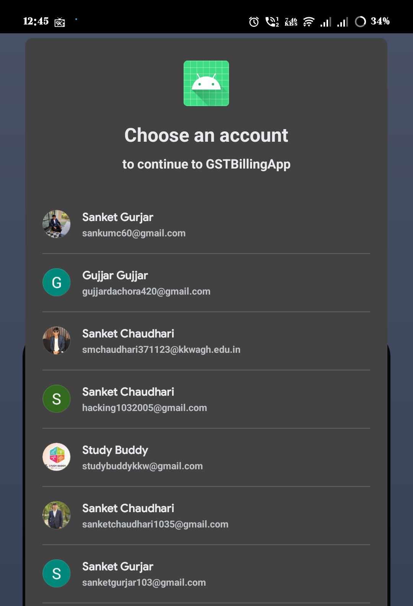
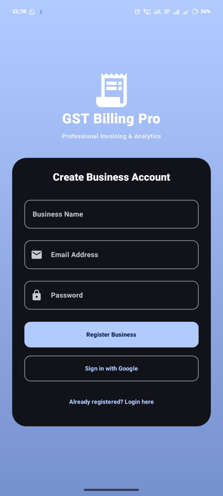
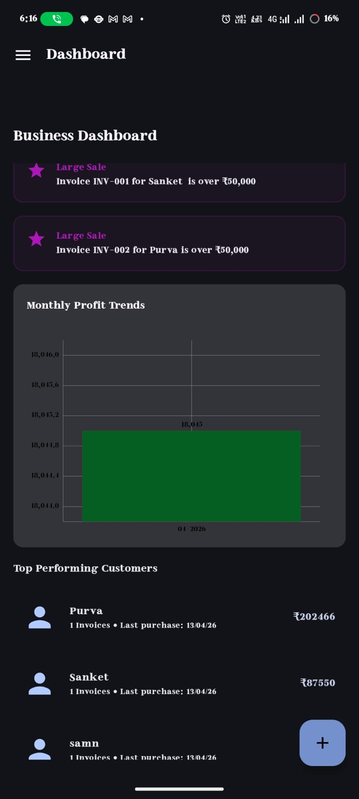
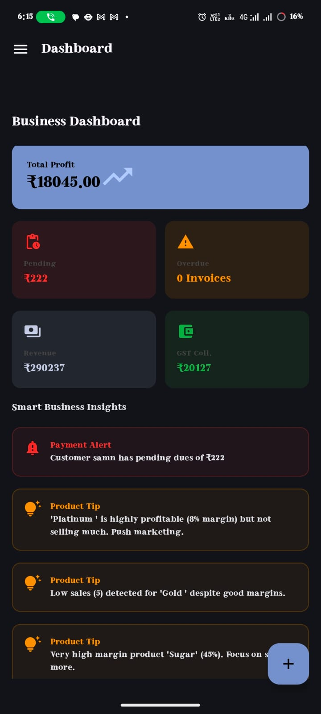
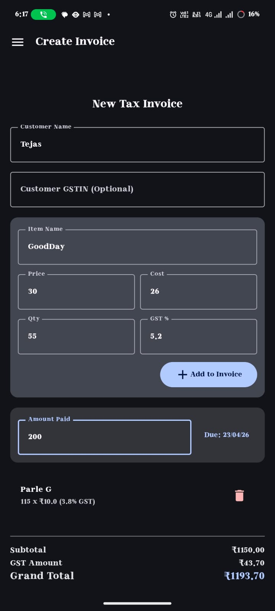
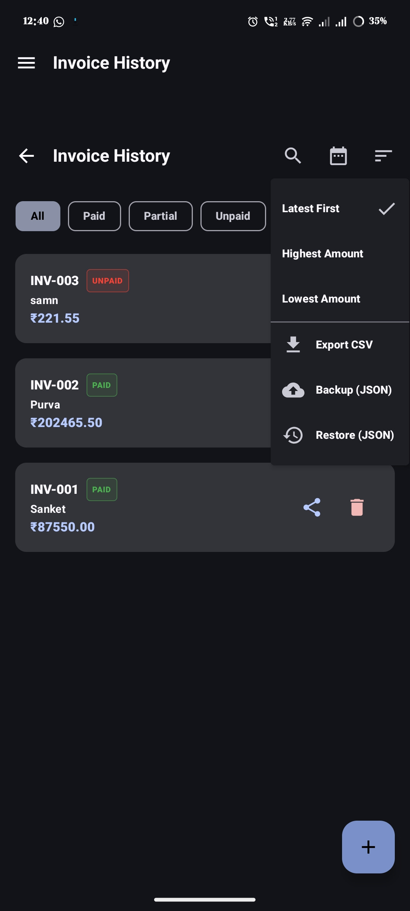
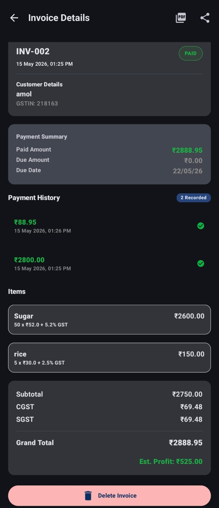
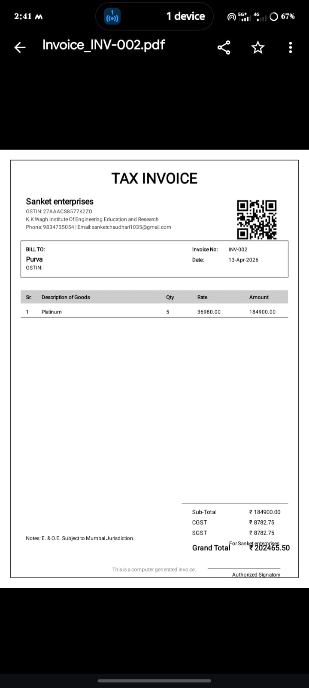

# GST Billing Pro 📊

A professional, feature-rich Android application designed for small business owners to manage invoices, track payments, and generate GST-compliant PDFs.

## 🎯 Problem Statement

Small businesses often struggle with manual invoice creation, payment tracking and GST calculations.

This application digitizes the entire workflow.

---

## 🚀 Key Features

- **🔐 Secure Authentication**: Integrated with Google Sign-In for a seamless login experience.
- **👥 Multi-User Data Isolation**: Data is securely isolated per user using Firebase UID and reactive Room flows.
- **📈 Business Dashboard**: Real-time analytics showing total revenue, pending payments, and monthly sales charts.
- **📄 Professional PDF Generation**: 
  - Customizable business profile (Logo, Name, GSTIN, Address).
  - Automated GST calculations (CGST/SGST).
  - Dynamic QR codes for invoice verification.
  - Digital signature placeholder.
- **📑 Invoice Management**:
  - Full CRUD operations for invoices and items.
  - Advanced filtering (Paid, Unpaid, Partial statuses).
  - Quick Action FAB for rapid invoice creation.
- **💰 Payment Tracking**: Record partial or full payments with history logs.
- **📂 Navigation Drawer**: Modern, professional side-drawer navigation for easy access to all modules.


## 🛠️ Tech Stack

- **Language**: Kotlin
- **UI Framework**: Jetpack Compose
- **Architecture**: MVVM (Model-View-ViewModel)
- **Database**: Room (with Migrations)
- **Networking/Auth**: Firebase Auth & Google Sign-In
- **PDF Engine**: Android Graphics PdfDocument
- **Navigation**: Compose Navigation with ModalNavigationDrawer
- **Charts**: MPAndroidChart

## 📸 Screenshots

| Login | Register |
|-------|----------|
|  |  |

| Dashboard 1 | Dashboard 2 |
|-------------|-------------|
|  |  |

| Create Invoice | Invoice History | Invoice Details |
|----------------|-----------------|------------------|
|  |  |  |

| PDF Preview |
|-------------|
|  |

## 🏗️ System Architecture

```text
                    ┌─────────────────────┐
                    │      Android App    │
                    │  Jetpack Compose UI │
                    └──────────┬──────────┘
                               │
                               ▼
                    ┌─────────────────────┐
                    │     ViewModels      │
                    │   State Management  │
                    └──────────┬──────────┘
                               │
                               ▼
                    ┌─────────────────────┐
                    │    Repository Layer │
                    │ Business Logic Hub  │
                    └───────┬─────┬───────┘
                            │     │
             ┌──────────────┘     └──────────────┐
             ▼                                   ▼

 ┌─────────────────────┐             ┌─────────────────────┐
 │     Room Database   │             │ Firebase Services   │
 │                     │             │                     │
 │ • Invoices          │             │ • Authentication    │
 │ • Customers         │             │ • Google Sign-In    │
 │ • Payments          │             │ • User Isolation    │
 │ • Products          │             │                     │
 └─────────────────────┘             └─────────────────────┘
             │
             ▼
 ┌─────────────────────┐
 │ Analytics Engine    │
 │                     │
 │ • Revenue Analysis  │
 │ • Profit Tracking   │
 │ • Business Insights │
 │ • Customer Ranking  │
 └──────────┬──────────┘
            │
            ▼
 ┌─────────────────────┐
 │ PDF Generator       │
 │                     │
 │ • GST Invoice PDF   │
 │ • QR Code Creation  │
 │ • Digital Signature │
 │ • Invoice Sharing   │
 └─────────────────────┘
```

### Architecture Flow

User → Compose UI → ViewModel → Repository

Repository interacts with:

- Room Database for offline storage
- Firebase Authentication for secure login
- Analytics Engine for business insights
- PDF Engine for GST invoice generation

The application follows the MVVM architecture pattern to ensure scalability, maintainability, and testability.

---

## 🧩 Key Challenges Solved

- Multi-user data isolation
- Offline storage using Room
- GST calculations
- Dynamic PDF generation
- Revenue analytics

---

## 🔮 Future Improvements

- Cloud sync
- Customer analytics
- AI expense prediction
- GST filing integration

---

## ⚙️ Setup & Installation

1. Clone the repository:
   ```bash
   git clone https://github.com/sanket1035/GSTbillingApp.git
   ```
2. Add your `google-services.json` to the `app/` directory.
3. Build the project in Android Studio.
4. Run on an emulator or physical device (API 24+).

## 📄 License

This project is licensed under the MIT License - see the [LICENSE](LICENSE) file for details.

---
Built with ❤️ by Sanket Chaudhari for Small Businesses.
